# Java Application Deployment with Reverse Proxy on AWS

## 📌 Project Overview

This project is an AWS-based deployment of a **Java Student Registration Web Application** using a **reverse proxy architecture**.

The project assignment requires two Linux-based EC2 instances: one for the Java backend application and one for the reverse proxy. The backend application is intended to run internally on **port 8080**, while the reverse proxy provides the public entry point. The application uses **Amazon RDS MySQL** for student registration data.

The project also includes supporting AWS backup and recovery work, database verification, and an EC2 restore workflow, as shown in the supplied project screenshots.

---

## 🎯 Objectives

- Deploy a Java-based Student Registration Web Application on AWS.
- Host the Java WAR application using a Servlet container such as Apache Tomcat.
- Run the backend application internally on port **8080**.
- Deploy a second EC2 instance as a reverse proxy using Nginx or Apache HTTP Server.
- Forward public requests through the reverse proxy to the backend application.
- Restrict direct public access to the backend EC2 instance.
- Use Amazon RDS MySQL for database storage.
- Configure JDBC/MySQL Connector for application-to-database connectivity.
- Verify that registration data is stored in MySQL.
- Use AWS Backup concepts for resource protection and recovery.

---

## 🏗️ Architecture

```text
                         Internet
                            |
                            v
                 +----------------------+
                 |   Reverse Proxy EC2  |
                 |     Nginx / Apache   |
                 |       Port 80        |
                 +----------+-----------+
                            |
                     Internal traffic
                         Port 8080
                            |
                            v
                 +----------------------+
                 |    Backend EC2        |
                 | Java Student App      |
                 |   Apache Tomcat       |
                 |      Port 8080        |
                 +----------+-----------+
                            |
                         JDBC/MySQL
                            |
                            v
                 +----------------------+
                 |     Amazon RDS        |
                 |        MySQL          |
                 | Student Registration  |
                 +----------------------+
```

### Request Flow

```text
Browser
   |
   | HTTP request
   v
Reverse Proxy EC2 :80
   |
   | proxy / forward
   v
Backend Java EC2 :8080
   |
   | JDBC
   v
Amazon RDS MySQL :3306
```

---

## ☁️ AWS Services

| Service | Role |
|---|---|
| **Amazon EC2** | Hosts the reverse proxy and Java backend application |
| **Amazon RDS for MySQL** | Database for student registration data |
| **Amazon VPC** | Network environment for AWS resources |
| **Security Groups** | Controls access between proxy, backend, and database |
| **IAM** | AWS permissions and resource access |
| **AWS Backup** | Backup and recovery of project resources shown in the evidence screenshots |

---

## 🛠️ Technologies & Tools

- Java
- Java WAR application
- Apache Tomcat / Servlet container
- Nginx or Apache HTTP Server
- MySQL
- MySQL Connector/J
- Linux
- AWS EC2
- Amazon RDS
- AWS Backup
- Git / GitHub

---

# 1. Infrastructure Setup

The assignment requires two Linux-based EC2 instances:

### Backend EC2

The backend server hosts the Java Student Registration application. The application is intended to run inside a Servlet container and listen on **port 8080**.

### Reverse Proxy EC2

The second EC2 instance acts as the public entry point. It receives client requests and forwards them to the backend application over internal networking.

> The supplied screenshots do not visibly show the reverse-proxy configuration file itself, so this README describes the required architecture from the project assignment without claiming a configuration that is not visible in the supplied evidence.

---

# 2. Java Application Deployment

The application is a **WAR-based Java web application**.

The deployment flow is:

```text
Student WAR file
       |
       v
Apache Tomcat
       |
       v
Java Web Application
       |
       +----> Port 8080
       |
       +----> MySQL/RDS
```

The application is expected to be accessible through the reverse proxy rather than directly from the public internet.

---

# 3. Amazon RDS MySQL

The project uses an Amazon RDS MySQL-compatible database for storing student registration information.

One of the supplied screenshots shows an RDS database with the identifier **`backupdb`**.

The Java application communicates with the database using JDBC and the MySQL Connector/J library.

---

# 4. MySQL Connector

The project assignment requires the MySQL Connector/J `.jar` file to be placed in the Servlet container's `lib` directory so that the Java application can establish a MySQL connection.

Database credentials should never be hard-coded into a public repository.

---

# 5. Reverse Proxy

The reverse proxy provides a controlled public entry point for the application.

Conceptually, the proxy performs:

```text
Client
  |
  | HTTP :80
  v
Reverse Proxy
  |
  | Forward request
  | HTTP :8080
  v
Backend Java Application
```

The backend Security Group should allow application traffic from the reverse proxy rather than allowing unrestricted internet access to port 8080.

---

# 6. Security Groups

A suitable security model for the assignment is:

| Source | Destination | Port | Purpose |
|---|---|---:|---|
| Internet | Reverse Proxy EC2 | 80 | Public application access |
| Reverse Proxy EC2 | Backend EC2 | 8080 | Internal application traffic |
| Backend EC2 | RDS MySQL | 3306 | Database connectivity |
| Administrator IP | EC2 | 22 | SSH administration |

The important security objective is to prevent direct public access to the backend application.

---

# 7. Application URL

The required access pattern is through the reverse proxy, for example:

```text
http://<Reverse-Proxy-Public-IP>/student
```

The exact URL depends on the deployed application context path and the public IP/DNS of the reverse proxy instance.

---

# 8. Database Verification

The supplied project evidence includes MySQL verification from the EC2 environment.

The screenshots show a `users` table being queried and a test record named **`Test User`**.

This provides evidence that the MySQL database can be accessed and queried from the project environment.

---

# 9. AWS Backup & Recovery Evidence

The supplied 18-page screenshot document contains substantial evidence of AWS Backup and recovery operations performed during the project work.

The evidence includes:

- EC2 instance `backup-ec2`
- Amazon RDS database `backupdb`
- AWS Backup plan `daily-backup-rule`
- Backup vaults including `project-vault`
- Recovery points for RDS and EC2 resources
- Completed backup jobs
- Protected resources
- EC2 restore workflow
- Application test page
- MySQL database verification

These screenshots are included in this repository under `screenshots/`.

---

# 10. Backup Workflow

```text
AWS Resource
     |
     v
AWS Backup Plan
     |
     v
Backup Vault
     |
     v
Recovery Point
     |
     v
Restore
```

The supplied evidence shows completed recovery points and backup jobs, followed by a restore workflow for an EC2 resource.

---

# 11. Project Screenshots

All **18 screenshots supplied in the project PDF** are included below in their original page order.

## Screenshot 01 — EC2 Instance

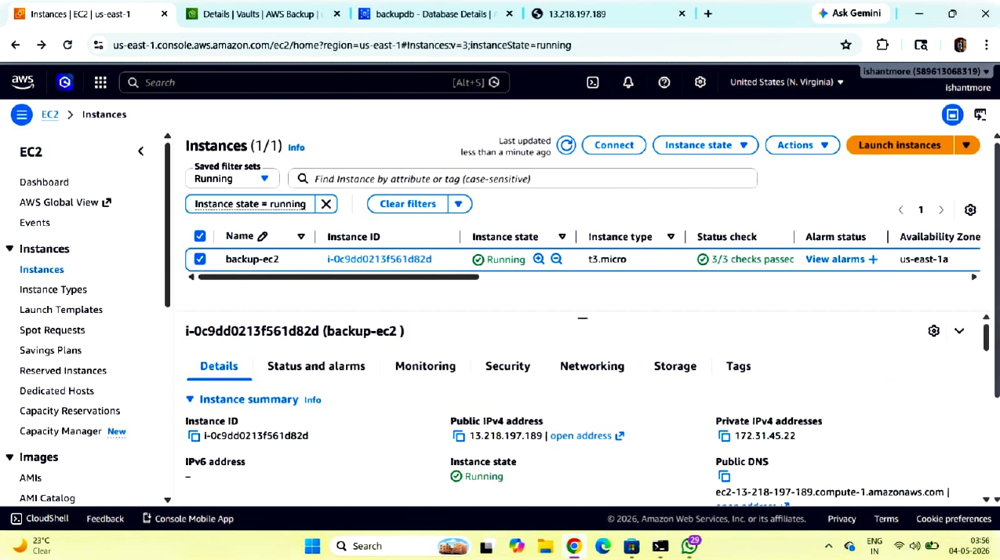

Shows the EC2 instance `backup-ec2` in a running state, including its public/private networking details.

## Screenshot 02 — RDS Database

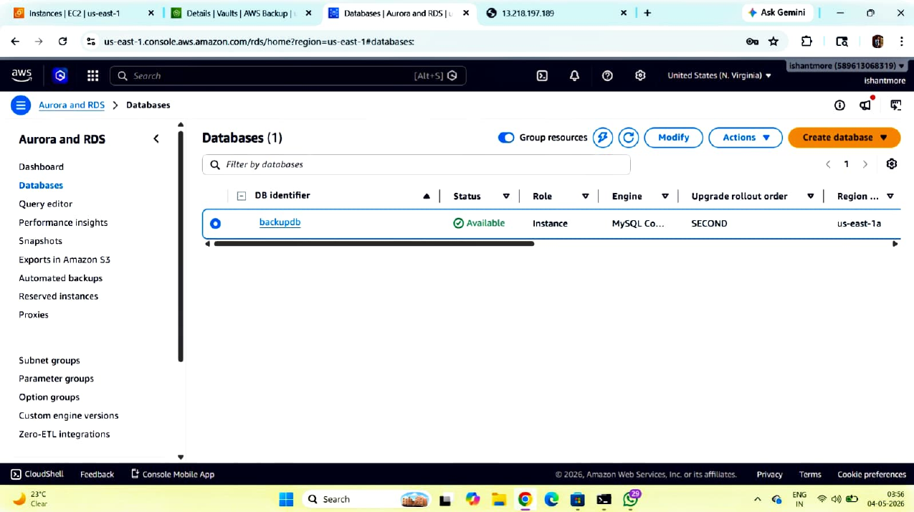

Shows the Amazon RDS database `backupdb` in an available state.

## Screenshot 03 — AWS Backup Plan

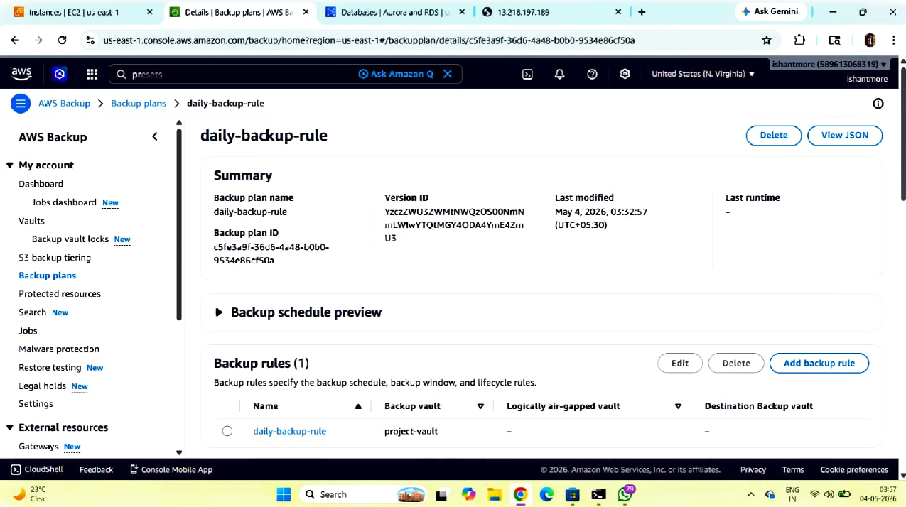

Shows the `daily-backup-rule` AWS Backup plan.

## Screenshot 04 — Backup Plan Details

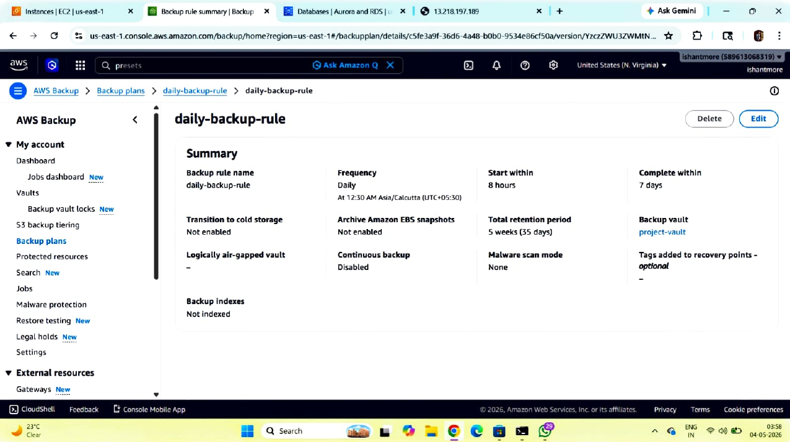

Shows backup frequency, start window, completion window, retention period, and backup vault configuration.

## Screenshot 05 — AWS Backup Vaults

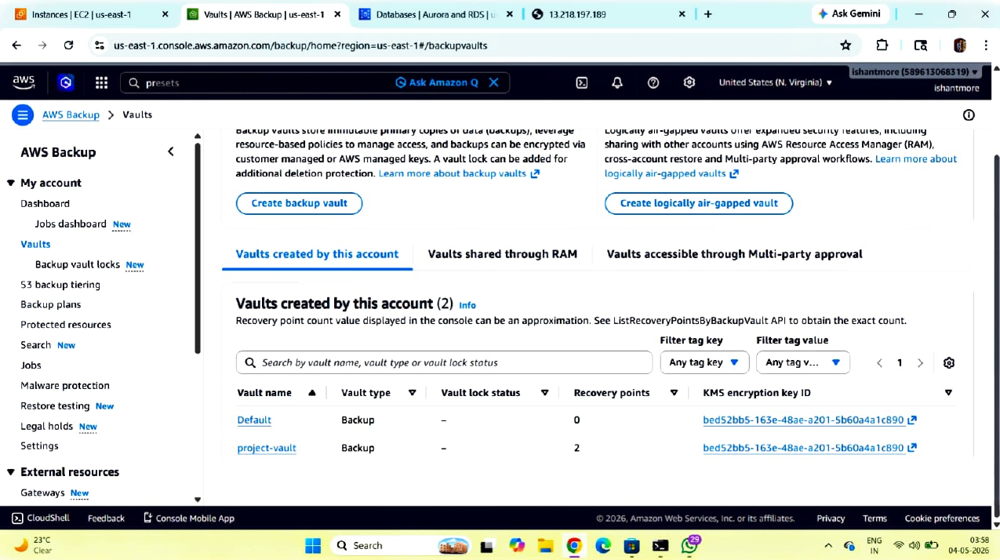

Shows the AWS Backup vault list, including `project-vault`.

## Screenshot 06 — Default Backup Vault

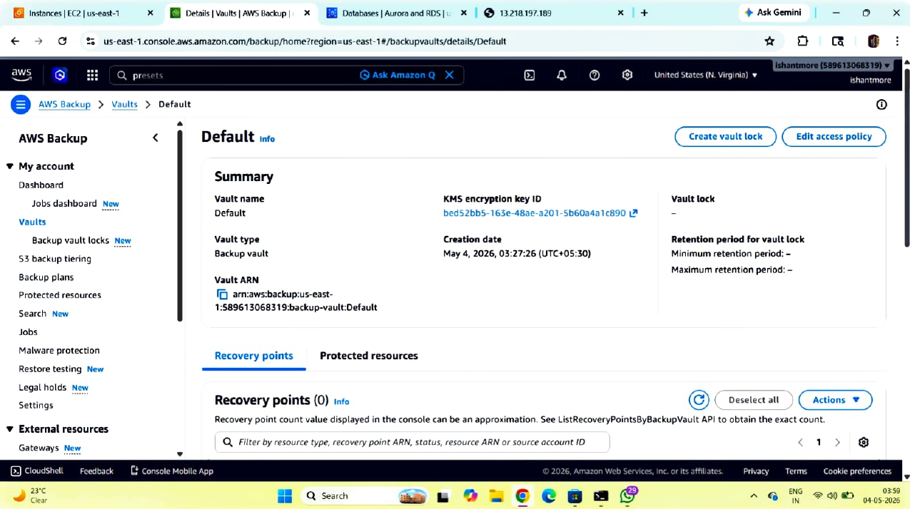

Shows details of the Default backup vault and its recovery-point section.

## Screenshot 07 — Project Backup Vault

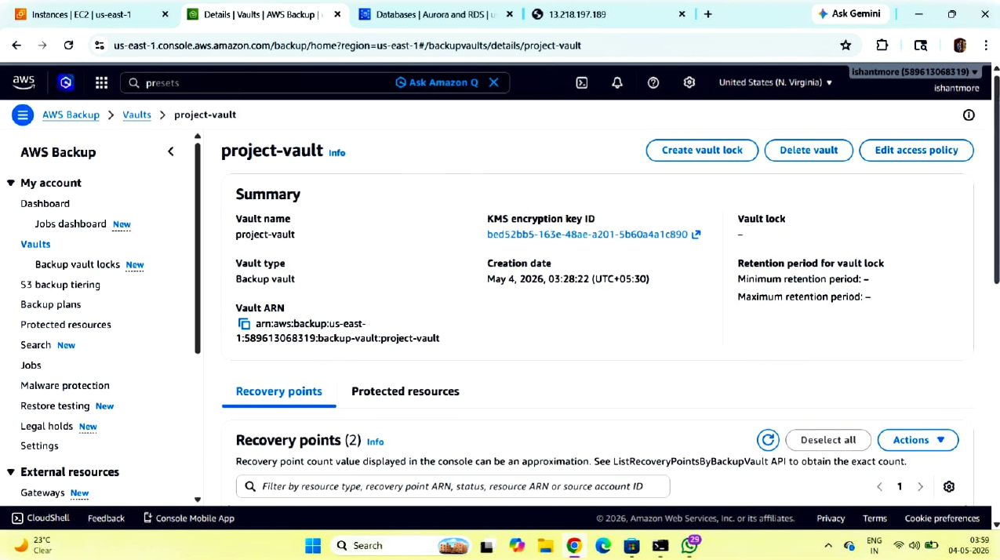

Shows the `project-vault` and its recovery points.

## Screenshot 08 — Recovery Points

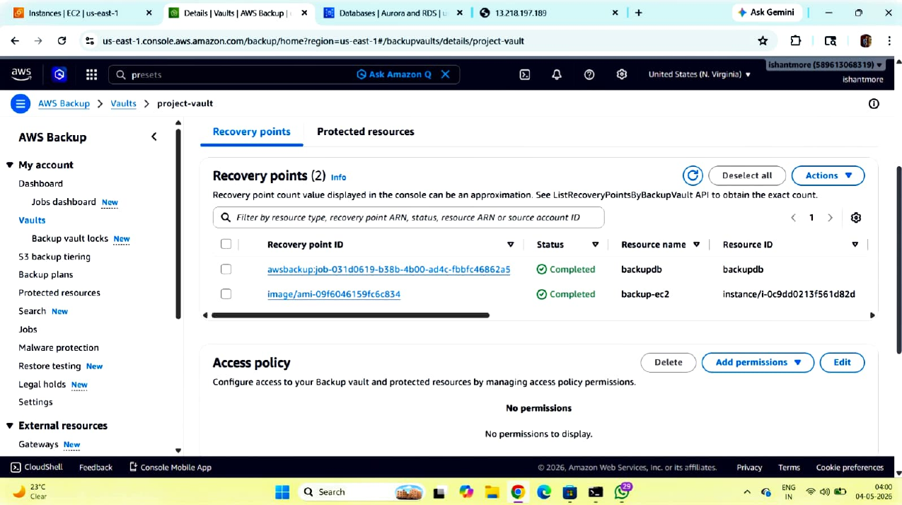

Shows completed recovery points for the protected resources.

## Screenshot 09 — RDS Recovery Point

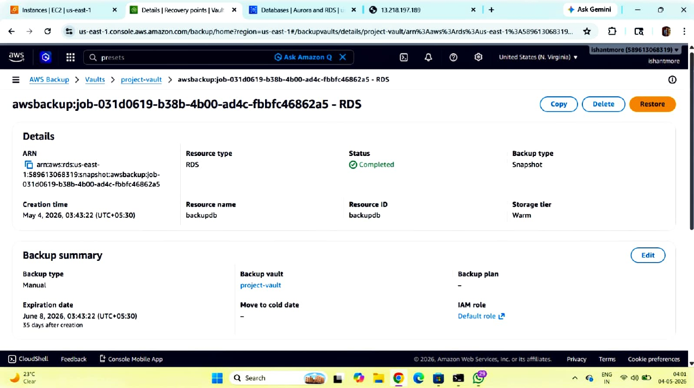

Shows an RDS recovery point with status **Completed** and resource name `backupdb`.

## Screenshot 10 — RDS Backup Job

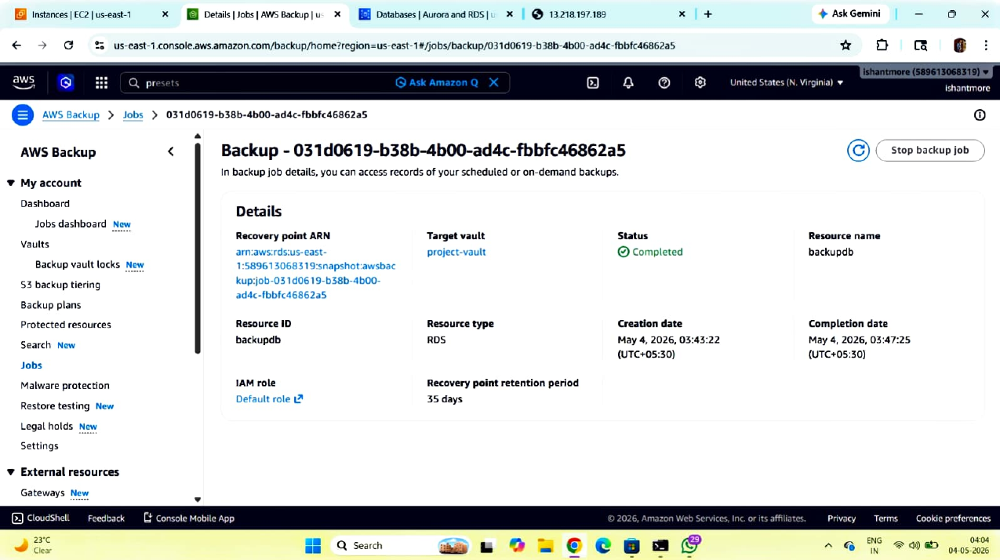

Shows an RDS backup job with **Completed** status and its recovery point information.

## Screenshot 11 — Protected Resources

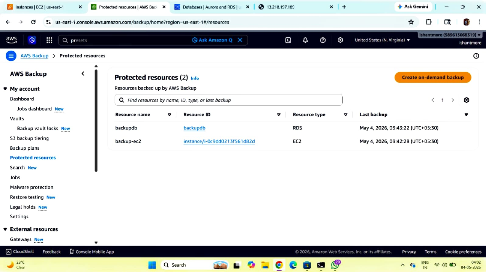

Shows the protected resources list containing the RDS database and EC2 resource.

## Screenshot 12 — EC2 Backup Job

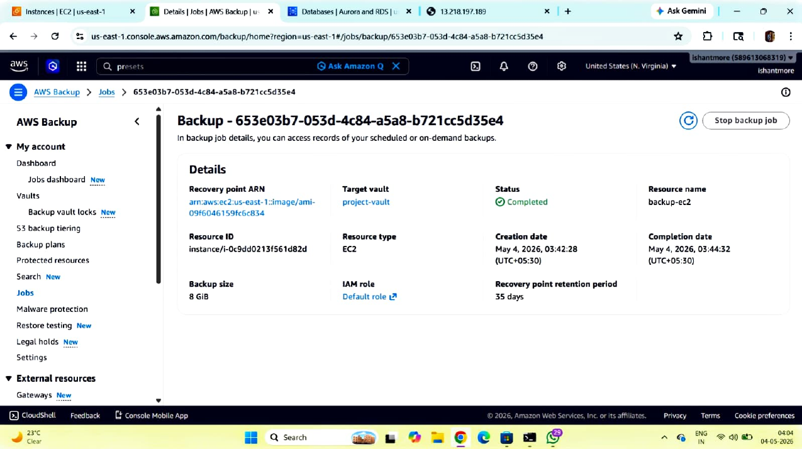

Shows an EC2 backup job with **Completed** status for `backup-ec2`.

## Screenshot 13 — RDS Recovery Points

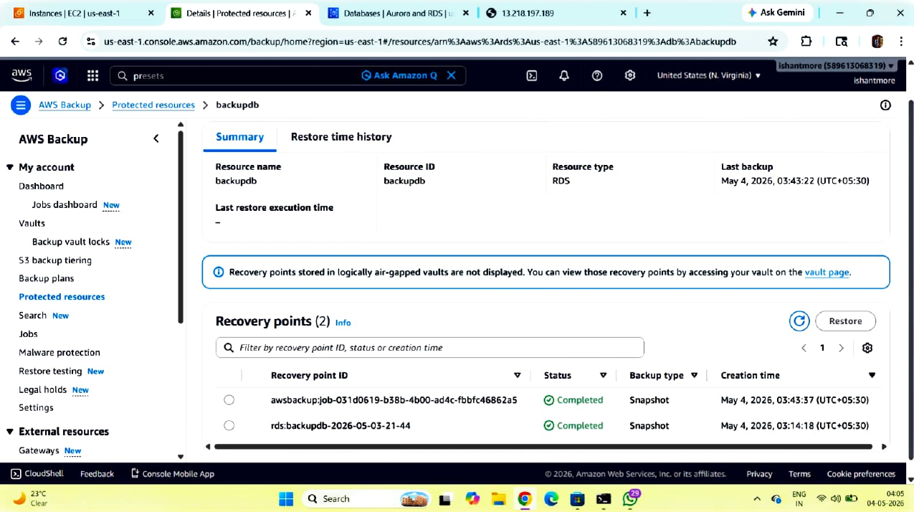

Shows recovery points associated with the RDS resource `backupdb`.

## Screenshot 14 — EC2 Recovery Point

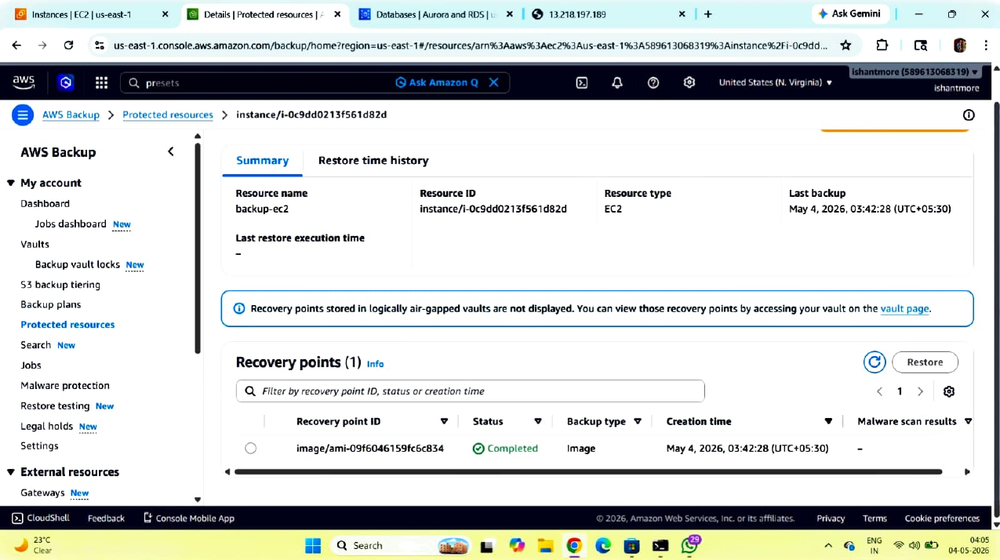

Shows the recovery point associated with the EC2 instance.

## Screenshot 15 — Restore Backup

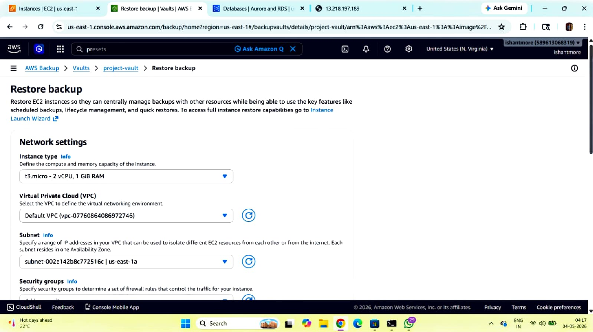

Shows the AWS Backup EC2 restore configuration, including instance type, VPC, subnet, and security group settings.

## Screenshot 16 — Application Test

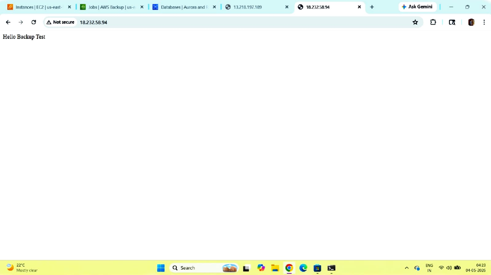

Shows the deployed test page displaying **“Hello Backup Test”**.

## Screenshot 17 — MySQL Verification

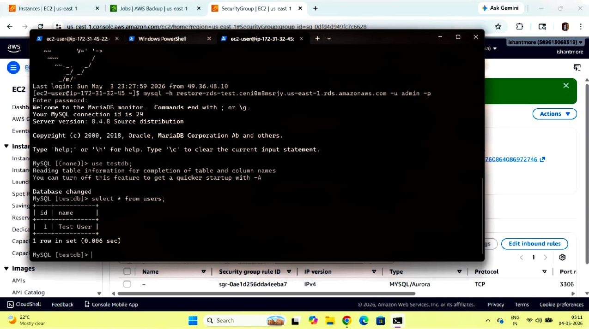

Shows a MySQL session connected from the EC2 environment and a query against the `users` table.

## Screenshot 18 — MySQL Database Verification

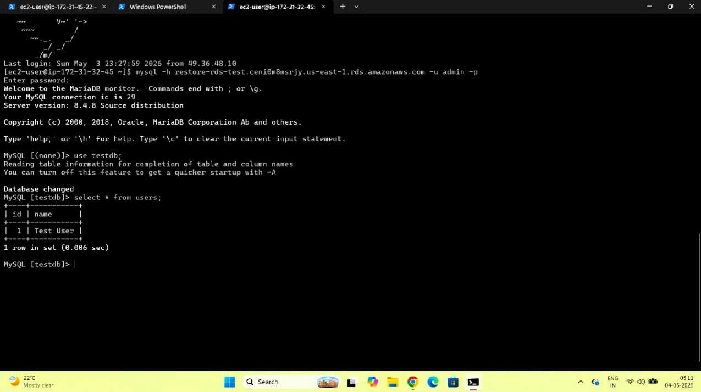

Shows the MySQL `users` table query and the test record **`Test User`**.

---

# 12. Testing & Verification

The supplied project evidence demonstrates the following:

- EC2 infrastructure is running.
- RDS MySQL database is available.
- AWS Backup plan is configured.
- Backup vaults are available.
- RDS and EC2 resources appear as protected resources.
- Backup jobs show **Completed** status.
- Recovery points are available.
- An EC2 restore workflow is configured.
- A web application test page is accessible.
- MySQL can be queried from the EC2 environment.
- A test user record is present in the database.

---

# 13. Challenges & Solutions

### Challenge 1 — Restricting backend access

**Solution:** Use Security Groups so the backend application accepts port 8080 traffic from the reverse proxy rather than exposing it directly to the internet.

### Challenge 2 — Database connectivity

**Solution:** Configure the MySQL Connector/J library and the application's RDS connection settings.

### Challenge 3 — Resource recovery

**Solution:** Use AWS Backup plans, vaults, recovery points, and restore workflows to protect AWS resources.

---

# 14. What I Learned

- Deploying applications on Amazon EC2
- Working with Linux-based cloud servers
- Java WAR application deployment concepts
- Reverse proxy architecture
- Nginx/Apache reverse proxy concepts
- Security Group-based access control
- Amazon RDS MySQL
- JDBC and MySQL Connector/J
- AWS Backup and recovery concepts
- Backup vaults and recovery points
- EC2 restore workflows
- Basic cloud disaster-recovery practices

---

# 15. Future Improvements

- Enable HTTPS using an SSL/TLS certificate.
- Use an Application Load Balancer for production-style traffic handling.
- Deploy across multiple Availability Zones for high availability.
- Add Auto Scaling for the application tier.
- Store database credentials in AWS Secrets Manager.
- Add Amazon CloudWatch monitoring and alarms.
- Automate infrastructure with Terraform or CloudFormation.
- Implement CI/CD using GitHub Actions or Jenkins.
- Add automated backup restore testing.

---

# 16. Security Best Practices

Never commit the following to GitHub:

```text
❌ AWS Access Keys
❌ AWS Secret Keys
❌ Database Passwords
❌ Private SSH Keys
❌ .pem files
❌ Production credentials
```

Use IAM roles, environment variables, and AWS Secrets Manager where appropriate.

---

# 17. Suggested Repository Structure

```text
java-application-reverse-proxy-aws/
│
├── README.md
│
├── screenshots/
│   ├── page-01.png
│   ├── page-02.png
│   ├── page-03.png
│   ├── ...
│   └── page-18.png
│
├── application/
│   └── student.war
│
└── config/
    └── reverse-proxy.conf
```

> Do not upload passwords, private keys, or other secrets.

---

# 👨‍💻 Author

**Ankur khurpadi **

Cloud / AWS Enthusiast

---

## ⭐ Project Summary

This project demonstrates a practical AWS architecture for deploying a Java Student Registration Web Application behind a reverse proxy, with Amazon RDS MySQL as the database layer. The supplied project evidence also demonstrates AWS Backup, recovery points, EC2 restore operations, application testing, and MySQL verification.
